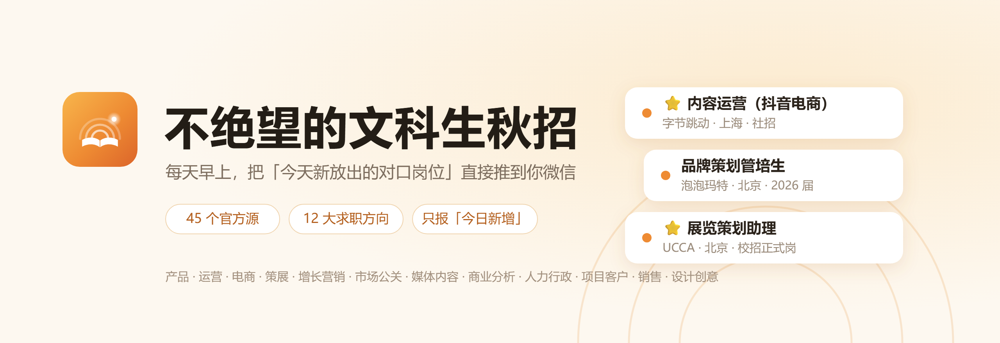
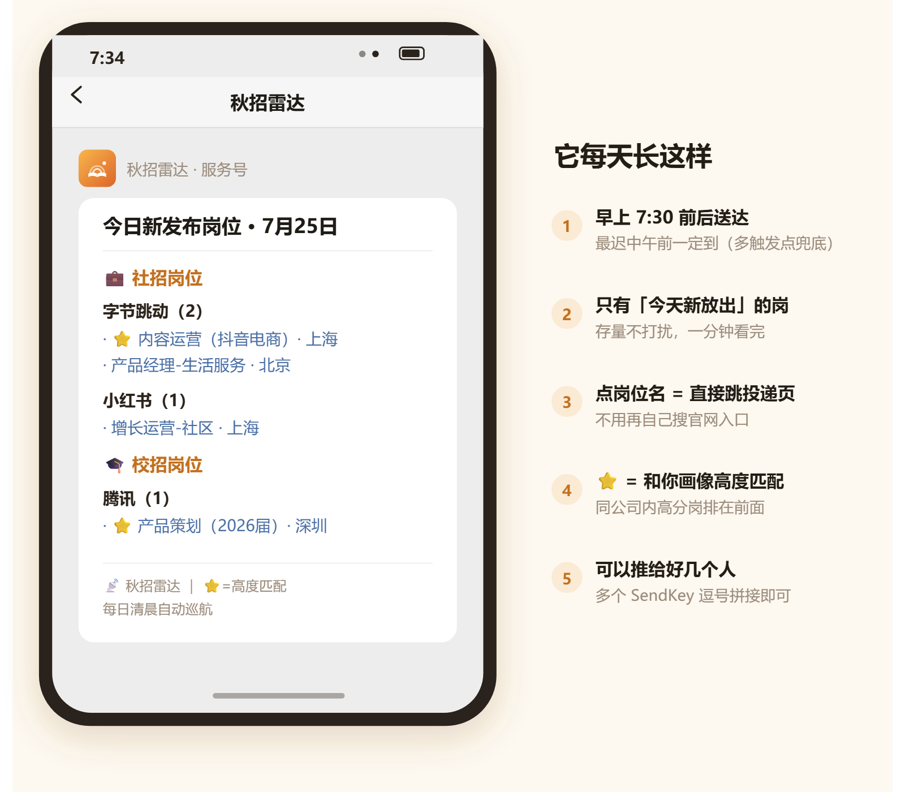
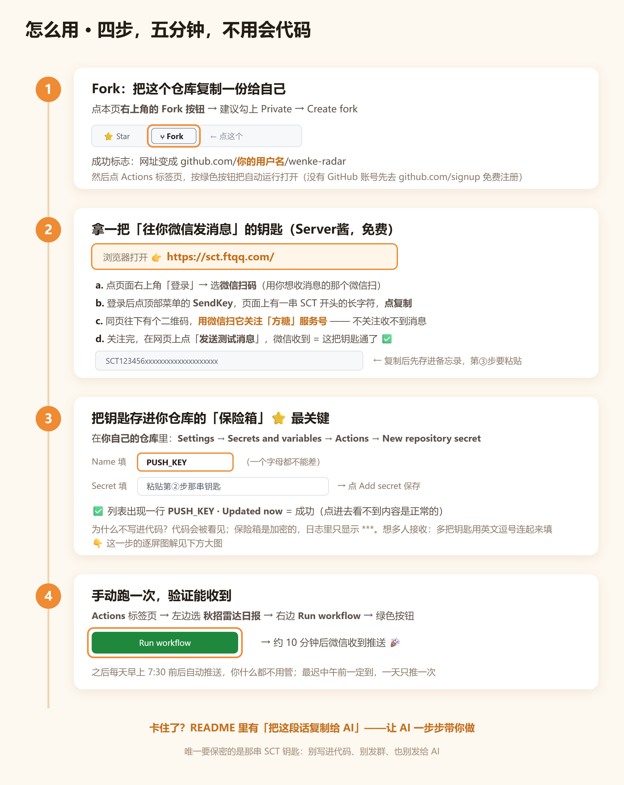
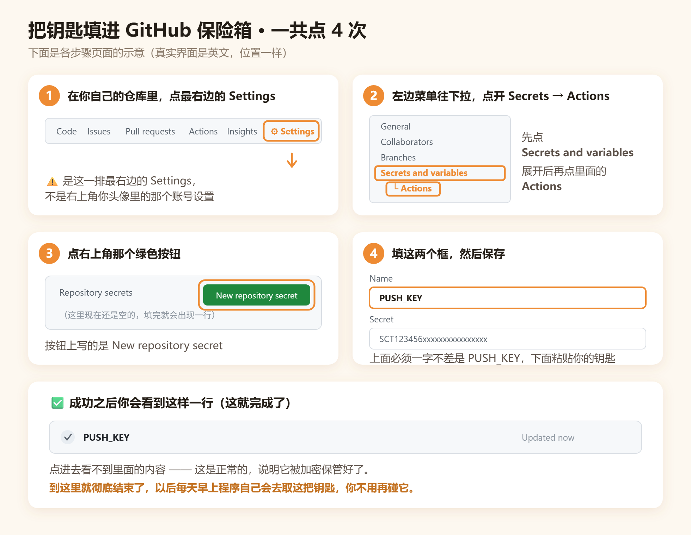

<p align="center">
  
</p>

<p align="center">
  
  
  
  
</p>

> **专门给和我一样绝望.jpg的文科生们的秋招自动岗位推送工具**：接入 30+ 家公司的 45 个官方招聘源头，
> 自动抓取**产品、运营、电商、策展、增长营销、市场公关、媒体内容、商业分析、人力行政、项目客户、销售、设计创意**
> 十二类非技术岗的**社招**与 **2026 / 2027 届秋招**新岗位，**每天早上 7:30 前后微信自动推送**。
> 默认**不限城市**（想只看某几个城市，改一行配置即可）。

<p align="center">
  
</p>

---

## 一、怎么用

<p align="center">
  
</p>

第 2 步要打开的网址（Server酱，免费）：**https://sct.ftqq.com/**
第 3 步（填保险箱）的逐屏图解：

<p align="center">
  
</p>

<details>
<summary><b>🤖 卡住了？把这段话复制给 AI，让它一步步带你做</b></summary>

<br>

不管哪一步卡住，把下面这段整段复制，发给任意 AI 助手（ChatGPT / Claude / 豆包 / 通义 / DeepSeek 都行）。
**注意：千万别把你的钥匙（SCT 开头那串）发给 AI。**

```text
我是 GitHub 零基础用户，正在配置一个开源项目「不绝望的文科生秋招」
（github.com/onism1767-creator/wenke-radar）。它是一个每天早上把新招聘岗位
推送到我微信的小工具。

我现在要做的事：我已经从 Server酱（sct.ftqq.com）拿到了一串 SCT 开头的 SendKey，
需要把它填进我自己 Fork 的那个 GitHub 仓库里，位置是
Settings → Secrets and variables → Actions → New repository secret，
名字必须叫 PUSH_KEY。

请你用最啰嗦、最零基础的方式，一步一步告诉我该点哪里。要求：
1. 每一步都描述"我在屏幕上应该看到什么"（按钮什么颜色、在页面哪个位置、写着什么英文）
2. 一次只讲一步，讲完等我回复"好了"再讲下一步
3. 如果我说看到的画面和你描述的不一样，先问我具体看到了什么，别急着往下讲
4. 我看不懂英文界面，请把每个英文单词的意思也解释一下

另外提醒我一句：过程中不要把 SendKey 本身发给你。
```

已经配完但**收不到推送**？把这段发给 AI：

```text
我在用一个叫「不绝望的文科生秋招」的 GitHub 项目（github.com/onism1767-creator/wenke-radar），
它通过 Server酱 往我微信推送招聘岗位。我已经把 SendKey 填进仓库的
Settings → Secrets and variables → Actions 里，名字是 PUSH_KEY，
但微信收不到消息。

请一步步帮我排查，每次只问我一个问题、等我回答再继续。我知道的线索：
（把你的情况写在这里，比如：GitHub Actions 里那次运行是绿色的还是红色的、
Server酱官网点"发送测试消息"微信能不能收到、有没有关注「方糖」服务号）
```

</details>

<details>
<summary><b>没收到推送？先自查这三条</b></summary>

<br>

1. **微信关注「方糖」服务号了吗？** 回 https://sct.ftqq.com/ 点「发送测试消息」，收不到就是这步没做好
2. **Secret 名字是一字不差的 `PUSH_KEY` 吗？** 全大写、下划线、无空格
3. **Actions 里那次运行是红的吗？** 点进去看报错；全渠道推送失败时 GitHub 也会自动发邮件提醒你

想让家人朋友一起收：各自拿钥匙，用英文逗号连起来填进同一个 `PUSH_KEY`。
运行被「防抢跑守卫」拦下 = 当天已经推过一次（防重复推送的保护）；要强制再跑，Run workflow 时勾上 `force`。

</details>

<details>
<summary><b>想改求职方向 / 城市 / 届别？想本地跑？想加新公司？</b></summary>

<br>

| 想做什么 | 怎么做 |
|---------|--------|
| 加自己的求职方向 | 只改 [`user_profile.py`](user_profile.py)（隔离用户区，写错也不影响抓取） |
| 改城市 / 届别 / 经验门槛 | `config.py` 的 `TARGET_CITIES` / `TARGET_GRAD_YEARS` / `SOCIAL_MAX_EXPERIENCE_YEARS` |
| 删掉不想看的方向 | `config.py` 的 `KEYWORDS` 里删掉那一组 |

本地运行：

```bash
pip install -r requirements.txt
PYTHONUTF8=1 python main.py --full   # 首次全量建库（Windows 必带 PYTHONUTF8=1）
PYTHONUTF8=1 python main.py          # 之后每日增量
```

加新源：北森/飞书/百库/Moka 平台的公司只要几行配置，详见 [CONTRIBUTING.md](CONTRIBUTING.md)。

</details>

---

## 二、接入了哪些公司

| 类别 | 公司 |
|------|------|
| **互联网大厂**（校招 + 社招） | 腾讯 · 字节跳动 · 阿里巴巴 · 百度 · 美团 · 京东 · 小红书 · B站 · 小米 · 滴滴 · 快手 · 网易 · 拼多多 · 淘宝 · 米哈游 |
| **快消 / 零售 / 消费品牌** | 泡泡玛特 · 名创优品 · 喜茶 · 蒙牛 · 伊利 · 统一 · 青岛啤酒 · 维达 · 欧莱雅 · 农夫山泉 · 元气森林 · 保利发展 |
| **文化 / 艺术机构** | UCCA 尤伦斯当代艺术中心 · 宽创国际 · 凯谛思 |
| **聚合兜底** | 牛客网校招日程 · OfferStar |

> 全部直连各公司招聘官网自己在用的公开接口，不碰 BOSS / 智联 / 前程无忧（要登录、违反其条款，合规红线）。

## 三、抓取哪些类型的岗位

| 方向 | 覆盖的岗位类型 |
|------|--------------|
| 电商 | 采销 / 商家运营 / 行业运营 / 品类运营 / 供应链 / 招商 / 跨境 / 渠道运营 … |
| 产品 | 产品经理 / 产品策划 / 数据产品 / 策略产品 / 产品运营 / B端C端产品 … |
| 运营 | 用户运营 / 内容运营 / 活动运营 / 社群运营 / 新媒体运营 / 直播运营 / IP运营 … |
| 策展 | 策展 / 展览 / 展陈 / 会展 / 文创 / 美术馆 / 博物馆 / IP授权 / 衍生品 / 公共教育 / 编辑出版 … |
| 增长营销 | SEO / GEO / 增长 / 营销 / 品牌 / 投放 / 用户增长 / AIGC / 内容营销 / BD / 管培生 … |
| 市场公关 | 公关 / 品牌公关 / 传播 / 媒介 / 政府事务 / 市场策划 / 活动执行 … |
| 媒体内容 | 编辑 / 记者 / 文案 / 撰稿 / 采编 / 编导 / 内容审核 / 翻译 / 本地化 … |
| 商业分析 | 商业分析 / 经营分析 / 数据分析 / 战略 / 咨询 / 行业研究 / 用户研究 … |
| 人力行政 | 人力资源 / HRBP / 招聘 / 培训 / 组织发展 / 薪酬 / 雇主品牌 / 行政 / 文秘 … |
| 项目客户 | 项目管理 / 项目经理 / PMO / 客户成功 / 客户经理 / 商务合作 … |
| 销售 | 大客户销售 / 商务拓展 / 销售管培 / 销售运营 / 区域经理 / 渠道经理 / KA 经理 … |
| 设计创意 | 视觉设计 / 平面设计 / 创意策划 / 包装设计 / 品牌设计 / 广告创意 / 展陈设计 … |

自动排掉实习岗、技术岗（工程师/算法/研发等）和要求 3 年以上经验的社招岗。
销售只收偏商务/管培的白领线（不收门店督导、店长等一线零售岗）；设计只收商业向创意岗
（不收游戏原画/3D/特效这类需美术功底+作品集的岗）。
不想看的方向删掉即可，也可在 [`user_profile.py`](user_profile.py) 加自己的方向。

## 四、如果它帮到你了

⭐ **点个 Star**，让更多秋招里的文科生看到它；想让雷达盯上你心仪的公司，来
[许愿加源](../../issues/new?template=new-source.yml)，其它建议欢迎提 [Issue](../../issues)。

---

<details>
<summary>合规与自律说明</summary>

- 只调用各公司**公开招聘页面自身在用的接口**，不绕过任何登录，不采集个人信息
- 每天一次的抓取频率，对目标站点的负载可以忽略；内置限速与重试退避
- 涉及的响应解码，仅用于读取页面上人人可见的公开岗位信息
- 若某公司对被收录有异议，提 issue 即从源列表移除
- 使用本工具产生的一切后果由使用者自行承担

</details>

**License**：[MIT](LICENSE) ｜ 项目思路启发自 [ruyi1/campus-radar](https://github.com/ruyi1/campus-radar)，代码为本项目独立实现。

<p align="center"><sub>祝你早日上岸 🌾</sub></p>
